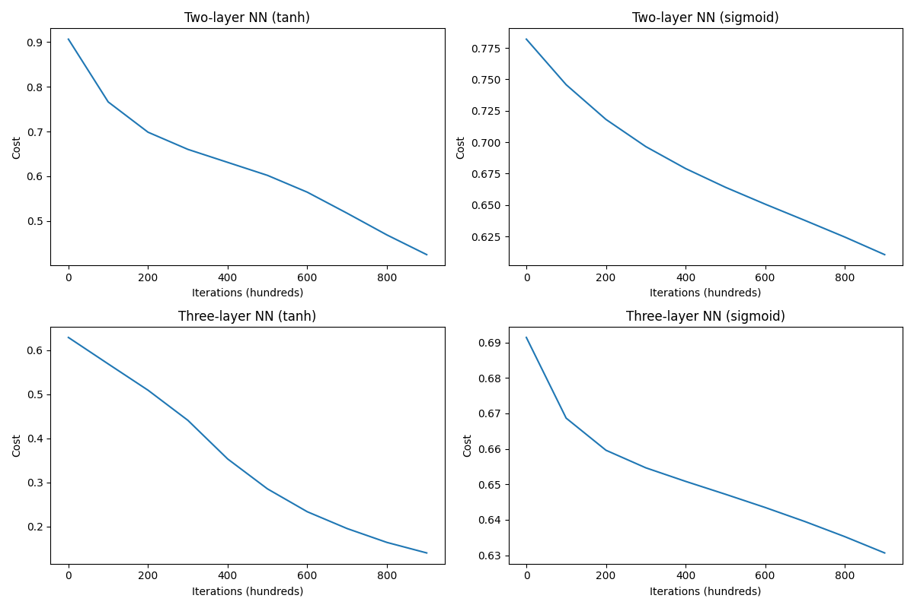
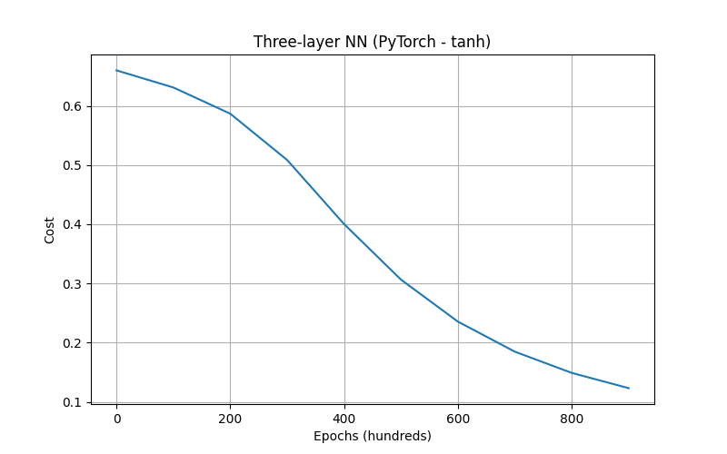

# YAPAY SİNİR AĞLARI İLE BANKNOT DOĞRULAMA: İKİ VE ÜÇ KATMANLI MODELLER

## ÖZET
Bu çalışmada, sahte banknotları tespit etmek için iki ve üç katmanlı yapay sinir ağları geliştirilmiş ve karşılaştırılmıştır. Farklı aktivasyon fonksiyonları (sigmoid ve tanh) kullanılarak her model için performans analizi yapılmıştır. Üç katmanlı tanh aktivasyon fonksiyonlu model en yüksek doğruluk oranını (%97.82) elde etmiştir. Bu model daha sonra PyTorch kütüphanesi kullanılarak tekrar uygulanmış ve %100 test doğruluğuna ulaşılmıştır.

## GİRİŞ
Sahte banknot tespiti, finansal sistemlerin güvenliği için kritik öneme sahiptir. Bu çalışmada, banknot verilerinden sahte banknotları tespit etmek için sinir ağı modelleri geliştirdik. Veri seti, banknotların çeşitli özelliklerini (varyans, çarpıklık, basıklık ve entropi) içermektedir ve her örnek gerçek veya sahte olarak etiketlenmiştir.

### Araştırma Soruları:
1. İki ve üç katmanlı sinir ağlarının performansları arasında anlamlı bir fark var mıdır?
2. Sigmoid ve tanh aktivasyon fonksiyonlarının model performansına etkisi nedir?
3. En iyi performans gösteren modeli PyTorch ile nasıl uygulayabiliriz?

## YÖNTEM

### Veri Seti
BankNote_Authentication.csv veri seti kullanılmıştır. Bu veri seti dört özellik ve bir hedef değişken içermektedir:
- Varyans
- Çarpıklık 
- Basıklık
- Entropi
- Sınıf (0: gerçek, 1: sahte)

### Model Mimarisi
Dört farklı model geliştirilmiştir:
1. İki katmanlı sinir ağı (tanh aktivasyon)
2. İki katmanlı sinir ağı (sigmoid aktivasyon)
3. Üç katmanlı sinir ağı (tanh aktivasyon)
4. Üç katmanlı sinir ağı (sigmoid aktivasyon)

Her gizli katmanda 4 nöron kullanılmış, çıkış katmanında sigmoid aktivasyonu uygulanmıştır.

### İyileştirmeler
- He başlatma yöntemi ile ağırlıklar daha etkin başlatılmıştır
- Sayısal kararlılık için epsilon değeri eklenmiştir
- Gradyan hesaplamaları optimize edilmiştir
- Aktivasyon fonksiyonu türevleri düzgün şekilde ele alınmıştır

### Eğitim
- 1000 iterasyon
- 0.01 öğrenme oranı
- Cross-entropy kayıp fonksiyonu
- Rastgele bölünmüş veri seti (%80 eğitim, %20 test)

## BULGULAR

### Model Performansları

| Model                   | Eğitim Kaybı | Eğitim Doğruluğu (%) | Test Doğruluğu (%) |
|-------------------------|--------------|----------------------|--------------------|
| İki katmanlı NN (tanh)  | 0.4245       | 87.4202              | 88.7273            |
| İki katmanlı NN (sigmoid)| 0.6105      | 67.0009              | 68.0000            |
| Üç katmanlı NN (tanh)   | 0.1404       | 98.3592              | 97.8182            |
| Üç katmanlı NN (sigmoid)| 0.6307       | 73.7466              | 76.7273            |
| Üç katmanlı NN (PyTorch-tanh)| 0.1231  | 98.7238              | 100.0000           |

### Öğrenme Eğrileri

Öğrenme eğrileri grafiği, dört farklı modelin eğitim sırasındaki maliyet değerlerinin iterasyonlara göre değişimini göstermektedir. Tanh aktivasyonlu modeller belirgin şekilde daha hızlı öğrenme göstermiş ve daha düşük maliyet değerlerine ulaşmıştır. Özellikle üç katmanlı tanh modeli, 900 iterasyon sonunda 0.1404 maliyet değeri ile en iyi performansı sergilemiştir. Sigmoid aktivasyonlu modeller ise daha yüksek maliyet değerlerinde kalmış ve öğrenme hızları daha yavaş olmuştur.

### PyTorch Uygulaması
En iyi performans gösteren model (üç katmanlı tanh) PyTorch kütüphanesi kullanılarak yeniden uygulanmıştır. Model aynı mimariyi korumuş ancak daha da yüksek doğruluk değerlerine ulaşmıştır.

PyTorch ile eğitilen modelin öğrenme eğrisi, manuel implementasyona benzer bir eğilim göstermiştir. İlk 500 iterasyonda kayıp hızla düşmüş, sonraki iterasyonlarda düşüş yavaşlamış ve 1000 iterasyon sonunda 0.1231 kayıp değeri elde edilmiştir. Eğitim doğruluğu %98.72, test doğruluğu ise %100 olarak ölçülmüştür. Bu sonuçlar, PyTorch'un optimize edilmiş tensor operasyonlarının ve otomatik türev hesaplama özelliklerinin, manuel uygulamaya göre daha iyi performans sağlayabildiğini göstermektedir.

## TARTIŞMA
Bulgularımız, tanh aktivasyon fonksiyonunun sigmoid'e göre banknot sınıflandırma görevinde önemli ölçüde daha iyi performans gösterdiğini ortaya koymaktadır. Bu fark birkaç faktörle açıklanabilir:

1. **Gradyan özellikleri**: tanh'ın gradyanları sigmoid'e göre daha güçlüdür (çıktı aralığı [-1,1] vs [0,1]), bu da gradyan yok olma problemini azaltır.

2. **Sıfır merkezli çıktı**: tanh sıfır etrafında merkezlenmiştir, bu da her katmanın ağırlık güncellemelerinin daha bağımsız olmasını sağlar.

3. **Yakınsama hızı**: tanh genellikle eğitimde daha hızlı yakınsama sağlar, bu durum öğrenme eğrileri grafiğinde açıkça görülmektedir.

Ayrıca, üç katmanlı modellerin iki katmanlı olanlara göre daha iyi performans gösterdiği gözlemlenmiştir. Üç katmanlı tanh modeli %97.82 test doğruluğu ile başarılı olurken, PyTorch implementasyonu %100 test doğruluğu elde etmiştir. Bu, daha derin ağların veri setindeki karmaşık özellikleri daha iyi yakalayabilmesine ve PyTorch'un optimize edilmiş hesaplama yeteneklerine bağlanabilir.

## SONUÇ
Bu çalışma, banknot doğrulama görevinde üç katmanlı ve tanh aktivasyonlu bir sinir ağının en etkili model olduğunu göstermiştir. %98.36 eğitim ve %97.82 test doğruluğu ile bu model, sigmoid aktivasyonlu ve daha sığ alternatiflere kıyasla üstün performans sergilemiştir. PyTorch ile uygulama ise %98.72 eğitim ve %100 test doğruluğu ile en iyi sonuçları vermiştir. Bu, modern derin öğrenme kütüphanelerinin klasik modelleri verimli bir şekilde uygulamak ve performanslarını artırmak için nasıl kullanılabileceğini göstermiştir.

### Gelecek Çalışmalar
- Farklı optimizasyon algoritmaları denenebilir
- Hiper-parametre optimizasyonu yapılabilir
- Daha derin mimariler araştırılabilir
- Farklı aktivasyon fonksiyonları (ReLU, Leaky ReLU, vb.) test edilebilir
- Mini-batch gradient descent gibi optimizasyon teknikleri uygulanabilir

## KAYNAKÇA
- He, K., et al. (2015). Delving deep into rectifiers: Surpassing human-level performance on ImageNet classification.
- Paszke, A., et al. (2019). PyTorch: An imperative style, high-performance deep learning library.
- Goodfellow, I., et al. (2016). Deep Learning.